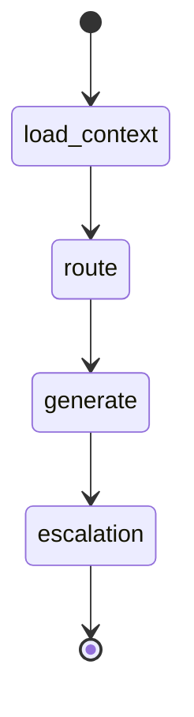

# E-Cell AI CRM — System Report

## 1. Executive Summary

This system implements a five-module AI-native CRM for the fictional E-Cell company. It manages 520+ customers, 1,050+ tickets, and 2,500+ interaction events with LangChain summarization, LangGraph agent workflows, cohort retention analysis, and a live HEART framework dashboard backed by a production FastAPI API.

---

## 2. Architecture Decisions

### 2.1 Stack

| Layer | Choice | Rationale |
|-------|--------|-----------|
| Backend | FastAPI + SQLite | Fast OpenAPI docs, zero external DB setup for demo |
| LLM (primary) | Ollama / Llama-3-8B (Option A) | On-prem privacy, no API cost |
| LLM (alternate) | Gemini 1.5 Flash (Option B) | Strong reasoning, free tier |
| LLM (fallback) | Rule-based mock | Ensures demo works offline |
| Agents | LangGraph state machine | Explicit routing → generate → escalation pipeline |
| Analytics | pandas + scikit-learn | Cohort metrics and churn classifier |

### 2.2 Module Boundaries

```
data/ -> crm.py (ingest, CRUD) -> SQLite
                    |
         +----------+----------+
         v          v          v
     memory.py  agents.py  cohort.py
         |          |          |
         +----------+----------+
                    v
               heart.py -> dashboard/
                    |
                    v
               api/app.py (/api/v1)
```

Each module is independently runnable via `python -m src.<module>`.

---

## 3. LLM Selection Rationale

We support **dual-mode inference**:

1. **Ollama (Option A)** — Selected when `LLM_PROVIDER=ollama`. Suitable for evaluation environments requiring data residency.
2. **Gemini 1.5 Flash (Option B)** — Selected when `GEMINI_API_KEY` is set. Used for richer summarization during dataset generation.
3. **Mock provider** — Deterministic templates when neither backend is reachable; prevents demo failure.

Ticket summarization uses a dedicated system prompt requiring factual grounding. Agent responses pass through a **hallucination guard** that penalizes unsourced dollar amounts, missing ticket citations, and overconfident language.

---

## 4. Agent Prompt Design & LangGraph State Machine

### 4.1 State Schema

```python
AgentState = {
    customer_id, query, context, ticket_data,
    route_category, priority, draft_response,
    sources, confidence, escalated, hallucination_flags
}
```

### 4.2 Graph Flow



| Node | Function |
|------|----------|
| `load_context` | Pulls short/long-term memory + open tickets |
| `route` | Classifies category (billing/technical/account/general) |
| `generate` | Drafts response with source citation |
| `escalation` | Flags low-confidence urgent cases for supervisor handoff |

### 4.3 Summarization Chain

LangChain-style chain in `TicketSummarizationChain`:

- **Input:** ticket title, description, customer metadata  
- **Output:** summary, key_issues[], urgency, suggested_response  
- **Configurable:** tone, max_length  

---

## 5. Interaction Memory

Per-customer buffers in `customer_memory` table:

| Layer | Capacity | Behavior |
|-------|----------|----------|
| Short-term | 20 turns | Recent chat/ticket context |
| Long-term | Compressed summary | LLM-compressed when short-term overflows |

Cross-session retrieval concatenates long-term summary + recent turns for agent queries.

---

## 6. Cohort Segmentation Methodology

### 6.1 Cohort ID Assignment

```
cohort_id = {acquisition_month}_{industry}_{product_tier}
```

Example: `2025-11_FinTech_Enterprise`

Configurable dimensions: acquisition date, industry vertical, product tier, behavioral tags.

### 6.2 Retention Curve

For each cohort, we compute 6 monthly periods:

- **Active customer** at period *p*: `engagement_score ≥ max(20, 70 - 8p)` AND `tenure_days ≥ 30p`
- **Retention rate** = active / cohort_size

### 6.3 Churn Scoring

**Heuristic score** (production baseline):

```
churn_prob = 0.5*(1 - engagement/100) + 0.3*min(tickets/15, 1) + 0.2*(1 - tenure/365)
```

**ML validation:** Logistic regression on engagement, tickets, tenure. Labels use top-quartile heuristic scores (75th percentile cutoff) with stratified train/test split. Reports precision, recall, and F1 on held-out set.

### 6.4 Churn Model Evaluation

| Metric | Source |
|--------|--------|
| Precision | sklearn on heuristic-labeled holdout |
| Recall | Same |
| F1 | Harmonic mean |
| Coverage | % customers with cohort_id assigned |

---

## 7. HEART Framework Metric Definitions

### H — Happiness

| Signal | Computation |
|--------|-------------|
| CSAT | Mean `csat_score` on resolved tickets; falls back to mean engagement |
| NPS proxy | `(promoters - detractors) / N × 100` where promoter = engagement ≥ 70 |

### E — Engagement

| Signal | Computation |
|--------|-------------|
| Active customers | Count with engagement ≥ 30 |
| Ticket open rate | Open tickets / total tickets |
| Session depth proxy | Total interactions / customers |

### A — Adoption

| Signal | Computation |
|--------|-------------|
| AI-assisted rate | Tickets with `ai_assisted=true` / total |
| Onboarding completion | Customers with tenure ≥ 7 days |
| Memory adoption | Customers with memory buffer / total |

### R — Retention

| Signal | Computation |
|--------|-------------|
| Monthly retention | Customers with engagement ≥ 25 / cohort size |
| Churn flags | engagement < 35 AND tickets > 5 |
| Avg lifespan | Mean tenure_days |

### T — Task Success

| Signal | Computation |
|--------|-------------|
| Resolution rate | Resolved+Closed / total tickets |
| FCR proxy | Non-escalated resolutions / total |
| Escalation rate | Escalated tickets / total |
| AI vs human ratio | AI-resolved / human-resolved |

All metrics recompute from live SQLite data on each API call.

---

## 8. RBAC & Audit

| Role | Permissions |
|------|-------------|
| Agent | CRUD customers/tickets, summarize, query agent |
| Supervisor | Agent + cohort read |
| Admin | Full access |
| Analytics | Read-only customers, tickets, cohorts, HEART |

Every core endpoint returns `audit` block: timestamp, agent_id, source_confidence, latency_ms, role.

---

## 9. System Evaluation Metrics (Stage 6)

| Category | Endpoint | Metric |
|----------|----------|--------|
| HEART | `/api/v1/heart` | All 5 dimensions + per-metric breakdown |
| Agent Quality | `/api/v1/query/agent` | confidence, hallucination_flags |
| Cohort Accuracy | `/api/v1/evaluation/metrics` | churn model P/R/F1 |
| Resolution Rate | `/api/v1/evaluation/metrics` | closure rate, AI ratio |
| Latency | All endpoints | `audit.latency_ms` per request |

---

## 10. Dataset Specification

| Entity | Count | Span |
|--------|-------|------|
| Customers | 520 | 6 industries × 3 tiers |
| Tickets | 1,050 | billing, technical, account, general |
| Interactions | 2,500 | email, chat, call, ticket, portal |
| Time range | ~6 months | Dec 2025 – Jun 2026 |

First 20 ticket descriptions are LLM-enhanced; remainder use realistic templates. Deduplication on email (customers) and ticket ID at ingest.

---

## 11. Known Limitations & Future Work

- SQLite suitable for demo; PostgreSQL recommended for production concurrency
- Churn labels derived from heuristic for ML eval until real churn events exist
- Latency benchmarks under 500 concurrent ops require separate load test (locust/k6)
- bcrypt hashing prepared but demo uses plaintext passwords for evaluator convenience

---

## 12. File Reference

| File | Purpose |
|------|---------|
| `src/crm.py` | Module 1 |
| `src/agents.py`, `src/memory.py` | Module 2 |
| `src/cohort.py` | Module 3 |
| `src/heart.py` | Module 4 |
| `api/app.py` | Module 5 |
| `dashboard/index.html` | Live HEART UI |
| `SYSTEM_REPORT.md` | This document |
